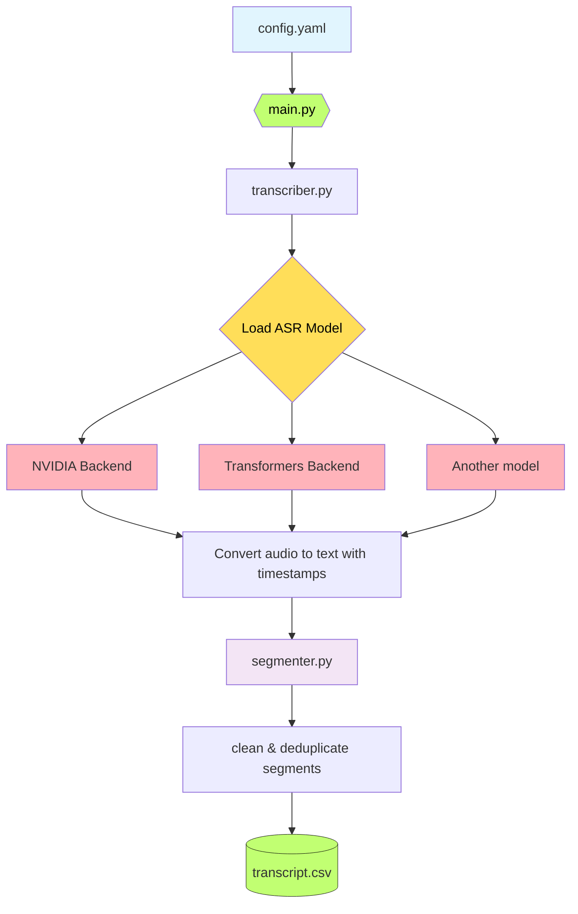

# 📝 text please! — Intelligent Audio Transcription

**textplease** transforms your long-form audio and video files into accurate, structured transcripts with intelligent segmentation and precise timestamps.

## 🎯 Why you might need it?
Perfect for researchers, content creators, podcasters, students, journalists, and anyone who needs quality transcripts from long recordings.
- Smart segmentation – breaks transcripts into logical segments based on pauses and topic changes rather than random time segments.
- Open-source support – uses state-of-the-art ASR models via Hugging Face.
- Long-form ready — handles hours of audio without quality degradation.
- Timestamp precision — every segment includes accurate start/end times.
- Easy start — simple YAML configuration with a `.csv` output.
- Local processing — your audio never leaves your machine.

## 🚀 Quick Start

### Installation
```bash
# Clone repo
git clone https://github.com/yourname/textplease.git
cd textplease

# Install dependencies using uv (recommended)
uv sync

# Activate the environment
source .venv/bin/activate
```

### Usage Options

#### 🌐 Web Interface
Launch the user-friendly Gradio web interface:
```bash
textplease --gradio
```

Then open your browser and:
1. Upload your audio/video file (.mp3, .wav, .mp4)
2. Adjust settings if needed (or use the smart defaults)
3. Click "🚀 Start Transcription"
4. Download your transcript when complete!

> 💡 Note: the config file will be created automatically.

#### 💻 Command Line Interface
For more precise settings, use this terminal command:
```bash
# Use the example config
textplease --config examples/config_example.yaml

# Or create your own config.yaml:
textplease --config my_config.yaml
```
After the process completes, the transcript will be saved to the path specified in `output_path` inside your config. For the example config, that will be `examples/LJSpeech-001_transcript.csv`

## 🏗️ How It Works
textplease uses a modular pipeline designed for accuracy and flexibility:
1. Audio Processing: extracts and preprocesses audio from video/audio files.
2. ASR Transcription: converts speech to text using advanced neural models.
3. Smart Segmentation: groups text into logical segments using:
    - pause detection (silence-based boundaries);
    - semantic analysis (topic coherence via sentence embeddings).
4. Post-Processing: cleans, deduplicates, and formats the final output.


## 🤖 Supported Models
- [nvidia/parakeet-tdt-0.6b-v2](https://huggingface.co/nvidia/parakeet-tdt-0.6b-v2) — fast, modern, accurate (recommended);
- extensible architecture supports additional Hugging Face models.

> ⚠️ Note: `textplease/backends/transformers_pipeline.py` hasn't been tested, it serves to demonstrate the extensibility of the project.

## 📥 Output Format
Transcripts are saved as tab-separated `.csv` files with:
| start\_time | end\_time | text                   |
| ----------- | --------- | ---------------------- |
| 00:00:00    | 00:00:06  | Welcome to the demo... |


## 🎛️ Advanced Features
- Automatic CUDA and MPS (Apple Metal) support for faster processing.
- Handles arbitrarily long files without memory issues.
- Automatic format conversion and resampling.
- Docker ready for an easy deployment.

## 📌 TODO
[ ] Optional NLP post-processing (summarisation)
[ ] API inference intregration (openai, Hugging Face Inference Endpoints)
[ ] Multilingual support
[ ] Diarization (multi-speaker support)
[ ] Subtitle generation (.srt)