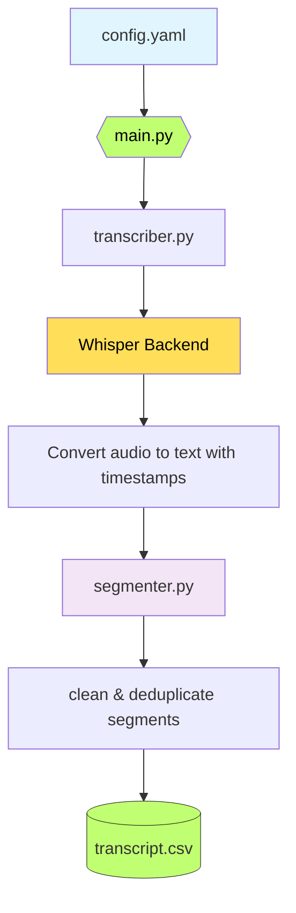

# text, please!

**textplease** converts long-form audio and video into accurate, structured transcripts with semantic segmentation and precise timestamps.

## Features

- Semantic segmentation – splits transcripts into coherent segments by pause and topic rather than fixed time windows.
- Long-form ready – handles hours of audio without quality degradation.
- Precise timestamps – every segment carries accurate start and end times.
- Open-source models – runs state-of-the-art ASR via Hugging Face Transformers.
- Simple I/O – YAML configuration in, tab-separated `.csv` out.
- Local processing – audio never leaves your machine.

## Quick Start

### Installation

```bash
git clone https://github.com/alozowski/textplease.git
cd textplease
uv sync
source .venv/bin/activate
```

### Web interface

```bash
textplease --gradio
```

Then, in your browser:

1. Upload an audio or video file (`.mp3`, `.wav`, `.mp4`, `.m4a`, `.ogg`).
2. Adjust the settings or keep the defaults.
3. Click **Start Transcription**.
4. Download the transcript when it completes.

The config file is created automatically.

### Command line

```bash
# Use the example config
textplease --config examples/config_example.yaml

# Or your own
textplease --config my_config.yaml
```

The transcript is written to the `output_path` set in the config. For the example config, that is `examples/LJSpeech-001_transcript.csv`.

## How It Works

textplease runs a modular pipeline:

1. Audio processing – extracts and normalizes audio from the input file.
2. ASR transcription – converts speech to text with multilingual Whisper models.
   - Language is selectable (97+ languages).
   - Silero-VAD removes silence before transcription, cutting hallucinations at the source.
   - Whisper batches VAD chunks on CUDA while retaining the same generation and timestamp settings.
   - Whisper runs via `model.generate()` with temperature fallback and compression-ratio quality gating.
   - A post-transcription filter removes known Whisper hallucination phrases.
   - Deduplication removes residual word overlap at chunk boundaries.
3. Segmentation – groups text into coherent segments using pause detection (aligned with VAD boundaries) and semantic similarity from sentence embeddings.
4. Post-processing – enforces length constraints, merges short segments, splits long ones, and writes the CSV.


```mermaid
flowchart TD
    A[config.yaml] --> B@{ shape: "hex", label: "main.py" }
    B --> C[transcriber.py]
    C --> D[Whisper Backend]
    D --> E[Convert audio to text with timestamps]
    E --> F[segmenter.py]
    F --> G[clean & deduplicate segments]
    G --> H@{ shape: "cyl", label: "transcript.csv" }

    style A fill:#e1f5fe
    style B color:#000000,fill:#C1FF72
    style D color:#000000,fill:#FFDE59
    style F fill:#f3e5f5
    style H fill:#C1FF72,stroke-width:0.5px,stroke:#000000
```

## Supported Models

Transcription runs on multilingual Whisper models via Hugging Face Transformers:

- [openai/whisper-large-v3](https://huggingface.co/openai/whisper-large-v3) — multilingual, 97+ languages

## Output Format

Transcripts are tab-separated `.csv` files:

| start_time | end_time | text                   |
| ---------- | -------- | ---------------------- |
| 00:00:00   | 00:00:06 | Welcome to the demo... |
