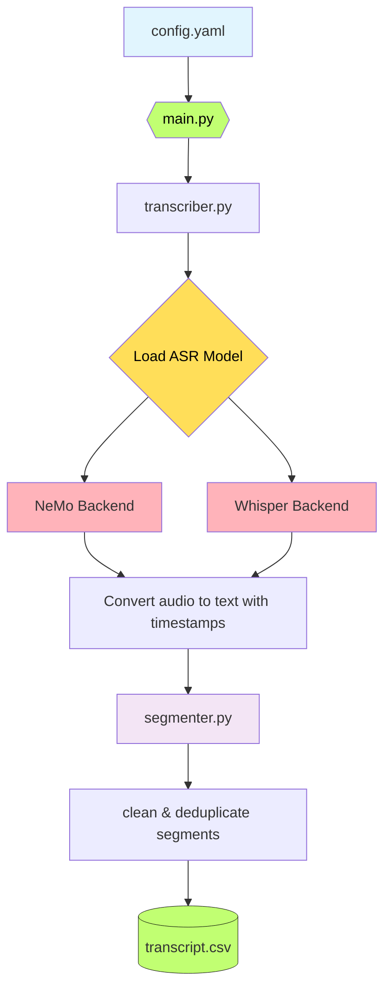

# 📝 text, please! — Intelligent Audio Transcription

**textplease** transforms your long-form audio and video files into accurate, structured transcripts with intelligent segmentation and precise timestamps.

## 🎯 Why you might need it?
Perfect for researchers, content creators, podcasters, students, journalists, and anyone who needs quality transcripts from long recordings.
- Smart segmentation – breaks transcripts into logical segments based on pauses and topic changes rather than random time segments.
- Open-source support – uses state-of-the-art ASR models via Hugging Face.
- Long-form ready — handles hours of audio without quality degradation.
- Timestamp precision — every segment includes accurate start/end times.
- Easy start — simple YAML configuration with a `.csv` output.
- Local processing — your audio never leaves your machine.

## 🚀 Quick Start

### Installation
```bash
git clone https://github.com/alozowski/textplease.git
cd textplease
uv sync
source .venv/bin/activate
```

### Usage Options

#### 🌐 Web Interface
Launch the user-friendly Gradio web interface:
```bash
textplease --gradio
```

Then open your browser and:
1. Upload your audio/video file (.mp3, .wav, .mp4, .m4a, .ogg)
2. Adjust settings if needed (or use the smart defaults)
3. Click "🚀 Start Transcription"
4. Download your transcript when complete!

> 💡 Note: the config file will be created automatically.

#### 💻 Command Line Interface
For more precise settings, use this terminal command:
```bash
# Use the example config
textplease --config examples/config_example.yaml

# Or create your own config.yaml:
textplease --config my_config.yaml
```
After the process completes, the transcript will be saved to the path specified in `output_path` inside your config. For the example config, that will be `examples/LJSpeech-001_transcript.csv`

## 🏗️ How It Works
textplease uses a modular pipeline designed for accuracy and flexibility:
1. **Audio Processing**: extracts and preprocesses audio from video/audio files.
2. **ASR Transcription**: converts speech to text using advanced neural models.
   - Supports both English-only (NeMo) and multilingual (Whisper) models
   - Language parameter available for Whisper models (supports 97+ languages)
   - Silero-VAD preprocessing: silence regions are removed before transcription, eliminating hallucinations at the source
   - Whisper uses `model.generate()` with temperature fallback and compression-ratio quality gating — no manual chunking artifacts
   - Post-transcription hallucination filter removes known Whisper false-positive phrases
   - Deduplication removes any remaining word overlap at chunk boundaries
3. **Smart Segmentation**: groups text into logical segments using:
   - Pause detection (silence-based boundaries, aligned with VAD split points)
   - Semantic analysis (topic coherence via sentence embeddings, batch-encoded for efficiency)
4. **Post-Processing**: enforces length constraints and formats the final output.
   - Merges segments that are too short
   - Splits segments that are too long (respects `max_segment_words` limit)
   - Filters empty segments and saves to CSV

```mermaid
flowchart TD
    A[config.yaml] --> B@{ shape: "hex", label: "main.py" }
    B --> C[transcriber.py]
    C --> D@{ shape: "diam", label: "Load ASR Model" }
    D --> D1[NeMo Backend]
    D --> D2[Whisper Backend]
    D1 --> E[Convert audio to text with timestamps]
    D2 --> E
    E --> F[segmenter.py]
    F --> G[clean & deduplicate segments]
    G --> H@{ shape: "cyl", label: "transcript.csv" }
    
    style A fill:#e1f5fe
    style B color:#000000,fill:#C1FF72
    style D color:#000000,fill:#FFDE59
    style D1 fill:#FFB3BA
    style D2 fill:#FFB3BA
    style F fill:#f3e5f5
    style H fill:#C1FF72,stroke-width:0.5px,stroke:#000000
```

## 🤖 Supported Models

### NeMo Backend (English only)
- [nvidia/parakeet-ctc-1.1b](https://huggingface.co/nvidia/parakeet-ctc-1.1b) — fast, modern, accurate

### Transformers Backend (Multilingual)
- [openai/whisper-large-v3](https://huggingface.co/openai/whisper-large-v3) — multilingual model (recommended for non-English)
- Extensible architecture supports additional Hugging Face models

## 📥 Output Format
Transcripts are saved as tab-separated `.csv` files with:
| start\_time | end\_time | text                   |
| ----------- | --------- | ---------------------- |
| 00:00:00    | 00:00:06  | Welcome to the demo... |
