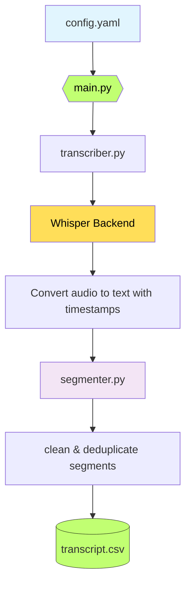

# text, please!

**textplease** converts local audio and video into timed, structured transcripts with open-source Whisper models.

## Features

- Semantic segmentation – splits transcripts into coherent segments by pause and topic rather than fixed time windows.
- Long-form path – uses non-truncated, timestamp-based Whisper decoding, with published 30- and 60-minute meeting results.
- Timed output – every segment carries a start and end time. Timestamp accuracy is tracked in the quality evaluation.
- Open-source models – runs state-of-the-art ASR via Hugging Face Transformers.
- Simple I/O – YAML configuration in, tab-separated `.csv` out.
- Local processing – audio never leaves your machine.
- Reproducible evidence – a pinned, licensed seed corpus records measured speech, non-speech, and timestamp failures.

## Quick Start

### Installation

Install these prerequisites:

- [Python 3.12](https://www.python.org/downloads/)
- [uv](https://docs.astral.sh/uv/getting-started/installation/)
- FFmpeg, with its `ffmpeg` executable available on `PATH`:

  - macOS with Homebrew: `brew install ffmpeg`
  - Ubuntu or Debian: `sudo apt install ffmpeg`
  - Windows: install a build from the [official FFmpeg download page](https://ffmpeg.org/download.html) and add its `bin` directory to `PATH`

Verify the native dependency with `ffmpeg -version`, then install `textplease`:

```bash
git clone https://github.com/alozowski/textplease.git
cd textplease
uv sync --locked --no-dev
```

### Prepare models once

Model download is a separate online setup step. While connected to the internet, cache the default Whisper and
segmentation models:

```bash
uv run --locked --no-dev hf download openai/whisper-large-v3
uv run --locked --no-dev hf download sentence-transformers/all-MiniLM-L6-v2
```

After preparation, `textplease` loads model weights from the cache or a local directory and does not download missing
weights during a transcription job. Hugging Face may still receive non-inference model metadata requests. Prefetch any
custom Hugging Face model ID with the same `hf download <model-id>` command. A local model directory also works.

### Web interface

```bash
uv run --locked --no-dev textplease --gradio
```

Then, in your browser:

1. Upload an audio or video file (`.mp3`, `.wav`, `.mp4`, `.m4a`, `.ogg`).
2. Adjust the settings or keep the defaults.
3. Click **Start Transcription**.
4. Download the transcript when it completes.

The config file is created automatically.

### Command line

```bash
# Use the example config
uv run --locked --no-dev textplease --config examples/config_example.yaml

# Or your own
uv run --locked --no-dev textplease --config my_config.yaml
```

The transcript is written to the `output_path` set in the config. For the example config, that is `examples/LJSpeech-001_transcript.csv`.

## Local privacy and retained files

Audio and transcript content are processed on-device and are not uploaded to Hugging Face or another cloud inference
API. Model acquisition and non-inference Hugging Face metadata may use the network. The Gradio UI binds to `127.0.0.1`,
cannot create a share tunnel, and has analytics and monitoring disabled. After preparing models, use an operating-system
firewall or disconnect the network if an externally enforced zero-network guarantee is required.

Temporary decoded PCM is removed after each job. Gradio checks hourly for uploaded cache files older than 24 hours and
clears its cache when the server restarts. Hugging Face model caches persist for reuse. The web interface also keeps each
job's transcript, effective configuration, and run log in a private directory under `output/`. Cancel removes temporary
PCM. Clear deletes that job directory and its retained artifacts. Download anything you need before clearing the form.

## Quality evidence

The committed evaluation is a small English regression set, not a production accuracy benchmark. It covers generated
silence, real rain and music, sub-second speech, a spoken name, two clean LibriSpeech excerpts, and continuous 30- and
60-minute AMI meeting excerpts with independent manual transcripts. Inference uses the public TextPlease pipeline and a
pinned Whisper Large v3 snapshot. See the [versioned baseline](evaluation/BASELINE.md),
[manifest](evaluation/manifest.jsonl), and [protocol](evaluation/protocol.json).

The protocol is a diagnostic fidelity profile. Its similarity threshold of 1.0 and minimum segment sizes of one preserve
recognition output for analysis, unlike the current UI-default paragraph settings of 0.75, 3 words, and 15 characters.
Two independent fresh processes produced identical normalized text and exact timestamps with matching error states at
seed 0 on the pinned MPS stack. PyTorch does not guarantee the same result across software releases or devices.

In the published run, the 30-minute case completed in 196.2 seconds at RTF 0.109 and 2484 MiB peak RSS with no timestamp
violation. The separate 60-minute case completed in 408.6 seconds at RTF 0.114 and 3305 MiB peak RSS with one timestamp
violation. Their WERs were 0.2733 and 0.2280. These measurements are machine-specific. Silence and rain now produce
successful header-only transcripts without loading Whisper, but held-out instrumental music still emits text. The
acceptance short name remains exact. The separate 437 ms tuning word now reaches recognition instead of being discarded,
but its final transcript is inexact and has one timestamp violation.

The evaluator downloads neither audio nor models. Prepare the exact model snapshot while online:

```bash
uv run --locked --no-dev hf download openai/whisper-large-v3 \
  --revision 06f233fe06e710322aca913c1bc4249a0d71fce1 \
  --include "*.json" \
  --include "*.txt" \
  --include model.safetensors
```

Pass the local snapshot path printed by that command to the evaluator:

```bash
git lfs pull --include="evaluation/fixtures/ami-ES2002b-30m.flac,evaluation/fixtures/ami-EN2001a-60m.flac"

uv run --locked python scripts/evaluate_audio_quality.py infer \
  --manifest evaluation/manifest.jsonl \
  --protocol evaluation/protocol.json \
  --model-snapshot <local-snapshot-path> \
  --device auto \
  --batch-size 1 \
  --output /tmp/textplease-quality-predictions.json

uv run --locked python scripts/evaluate_audio_quality.py score \
  --manifest evaluation/manifest.jsonl \
  --protocol evaluation/protocol.json \
  --predictions /tmp/textplease-quality-predictions.json \
  --output evaluation/BASELINE.md
```

For a same-environment repeatability check, run `infer` again to a second predictions path and add
`--parity-predictions <second-path>` to `score`.
The `score` command exits with status 1 when an enabled gate fails. That is expected for the current baseline while the
music and timestamp gates remain red.

Batch size 1 is the reference path. The report includes WER and CER edit counts, short-utterance exact match,
non-speech output and error counts, end-to-end interval and boundary measurements, timestamp invariants, real-time
factor, and peak memory. Release thresholds are versioned in the protocol and evaluate only held-out acceptance rows.
The final intervals include VAD, recognition, and post-processing behavior, so they are not presented as pure VAD
metrics. The final text also includes cleanup behavior and is not a raw Whisper-decoder fidelity measurement. AMI
meeting WER uses one chronological word stream for overlapping speakers and is not diarization-aware.

### Evaluation audio credits

| Fixture | License | Source and credit |
| --- | --- | --- |
| `silence-5s.wav` | CC0 1.0 | Generated for TextPlease with [FFmpeg `anullsrc`](https://ffmpeg.org/ffmpeg-filters.html#anullsrc) |
| `Rain.ogg` | Public domain | Recorded by Wikimedia Commons user ジダネ, from [Rain.ogg revision 597184901](https://commons.wikimedia.org/w/index.php?title=File:Rain.ogg&oldid=597184901) |
| `Greensleaves.ogg` | Public domain | Performed and recorded by Wikimedia Commons user Rv87, from [Greensleaves.ogg revision 845754359](https://commons.wikimedia.org/w/index.php?title=File:Greensleaves.ogg&oldid=845754359) |
| `En-uk-ear.ogg` | Public domain | Spoken and recorded by Wikimedia Commons user Chris Melville, from [En-uk-ear.ogg revision 1229077824](https://commons.wikimedia.org/w/index.php?title=File:En-uk-ear.ogg&oldid=1229077824) |
| `En-au-John.ogg` | CC BY-SA 4.0 | Spoken and recorded by Commander Keane, from [En-au-John.ogg revision 724849560](https://commons.wikimedia.org/w/index.php?title=File:En-au-John.ogg&oldid=724849560) |
| `sample1.flac` and `sample2.flac` | CC BY 4.0 | [LibriSpeech ASR Corpus](https://www.openslr.org/12/) by Vassil Panayotov, Guoguo Chen, Daniel Povey, and Sanjeev Khudanpur, with source samples hosted by [Hugging Face](https://huggingface.co/docs/hub/en/models-widgets-examples#automatic-speech-recognition) |
| `ami-ES2002b-30m.flac` and `ami-EN2001a-60m.flac` | CC BY 4.0 | Continuous, disjoint excerpts from the [AMI Meeting Corpus](https://groups.inf.ed.ac.uk/ami/corpus/) by the AMI Consortium. Text and speech intervals come from [manual annotations v1.6.2](https://groups.inf.ed.ac.uk/ami/download/) |

The project code is MIT licensed. Evaluation media retain the licenses recorded above and in the manifest. The manifest
records source provenance, license, attribution, duration, split, reference, and SHA-256 for every fixture. The long
fixtures are exact 30- and 60-minute continuous excerpts from different AMI meetings. Each cut starts and ends inside
gaps containing no lexical word annotations. They establish real meeting completion and resource evidence, plus
overlap-sensitive transcript and end-to-end interval regressions. They do not substitute for natural podcast or
monologue evidence or independently labeled acoustic boundaries.

Slow and fast spontaneous speech, noisy microphones, multilingual audio, natural long monologues, independently
annotated boundaries, intentional repetition, digits, and cleanup-target phrases are still missing. TextPlease does not
claim validated quality for those inputs until their rows exist in the baseline.

## How It Works

textplease runs a modular pipeline:

1. Audio processing – extracts and normalizes audio from the input file.
2. ASR transcription – converts speech to text with multilingual Whisper models.
   - Language is selectable from the languages supported by the configured Whisper checkpoint. The seed evaluation currently validates English only.
   - Silero VAD uses one internal automatic endpointing policy. Transcript grouping settings cannot change Whisper input.
   - VAD-negative audio succeeds with an empty transcript and never loads Whisper. Detector-positive non-speech remains a tracked release blocker.
   - Whisper batches VAD chunks on CUDA while retaining the same generation and timestamp settings.
   - Whisper runs via `model.generate()` with temperature fallback and compression-ratio quality gating.
   - A post-transcription filter removes known Whisper hallucination phrases.
   - Deduplication removes residual word overlap at chunk boundaries.
3. Segmentation – groups recognized spans using measured gaps and semantic similarity. Its pause setting changes layout only.
4. Post-processing – enforces length constraints, merges short segments, splits long ones, and writes the CSV.


```mermaid
flowchart TD
    A[config.yaml] --> B@{ shape: "hex", label: "main.py" }
    B --> C[transcriber.py]
    C --> D[Whisper Backend]
    D --> E[Convert audio to text with timestamps]
    E --> F[segmenter.py]
    F --> G[clean & deduplicate segments]
    G --> H@{ shape: "cyl", label: "transcript.csv" }

    style A fill:#e1f5fe
    style B color:#000000,fill:#C1FF72
    style D color:#000000,fill:#FFDE59
    style F fill:#f3e5f5
    style H fill:#C1FF72,stroke-width:0.5px,stroke:#000000
```

## Supported Models

Transcription runs on multilingual Whisper models via Hugging Face Transformers:

- [openai/whisper-large-v3](https://huggingface.co/openai/whisper-large-v3) — multilingual with 99 languages listed by the model publisher. TextPlease currently publishes quality evidence only for the English seed set.

Each model must be prefetched or provided as a local directory before transcription starts.

## Output Format

Transcripts are tab-separated `.csv` files:

A successful result with no transcribed speech contains only the column header.

| start_time | end_time | text                   |
| ---------- | -------- | ---------------------- |
| 00:00:00   | 00:00:06 | Welcome to the demo... |
