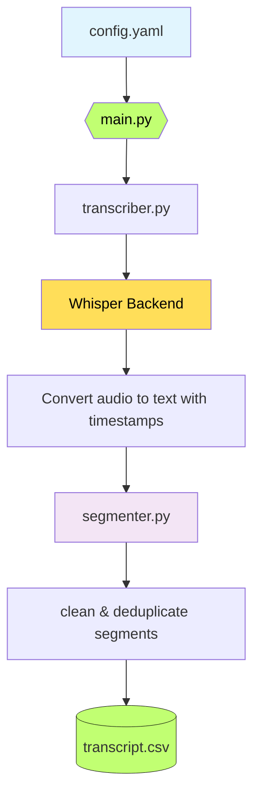

# text, please!

**textplease** converts long-form audio and video into accurate, structured transcripts with semantic segmentation and precise timestamps.

## Features

- Semantic segmentation – splits transcripts into coherent segments by pause and topic rather than fixed time windows.
- Long-form ready – handles hours of audio without quality degradation.
- Precise timestamps – every segment carries accurate start and end times.
- Open-source models – runs state-of-the-art ASR via Hugging Face Transformers.
- Simple I/O – YAML configuration in, tab-separated `.csv` out.
- Local processing – audio never leaves your machine.

## Quick Start

### Installation

Install these prerequisites:

- [Python 3.12](https://www.python.org/downloads/)
- [uv](https://docs.astral.sh/uv/getting-started/installation/)
- FFmpeg, with its `ffmpeg` executable available on `PATH`:

  - macOS with Homebrew: `brew install ffmpeg`
  - Ubuntu or Debian: `sudo apt install ffmpeg`
  - Windows: install a build from the [official FFmpeg download page](https://ffmpeg.org/download.html) and add its `bin` directory to `PATH`

Verify the native dependency with `ffmpeg -version`, then install `textplease`:

```bash
git clone https://github.com/alozowski/textplease.git
cd textplease
uv sync --locked --no-dev
```

### Prepare models once

Model download is a separate online setup step. While connected to the internet, cache the default Whisper and
segmentation models:

```bash
uv run --locked --no-dev hf download openai/whisper-large-v3
uv run --locked --no-dev hf download sentence-transformers/all-MiniLM-L6-v2
```

After that, `textplease` loads models only from local files. Transcription fails instead of downloading when a configured
model is missing. Prefetch any custom Hugging Face model ID with the same `hf download <model-id>` command; a local model
directory also works.

### Web interface

```bash
uv run --locked --no-dev textplease --gradio
```

Then, in your browser:

1. Upload an audio or video file (`.mp3`, `.wav`, `.mp4`, `.m4a`, `.ogg`).
2. Adjust the settings or keep the defaults.
3. Click **Start Transcription**.
4. Download the transcript when it completes.

The config file is created automatically.

### Command line

```bash
# Use the example config
uv run --locked --no-dev textplease --config examples/config_example.yaml

# Or your own
uv run --locked --no-dev textplease --config my_config.yaml
```

The transcript is written to the `output_path` set in the config. For the example config, that is `examples/LJSpeech-001_transcript.csv`.

## Local privacy and retained files

Audio and transcript content are processed locally. During transcription, supported model loaders are restricted to
local files. The Gradio UI binds to `127.0.0.1`, cannot create a share tunnel, and has analytics and monitoring disabled.
Use an operating-system firewall or disconnect the network when an external guarantee is required.

Temporary decoded PCM is removed after each job. Gradio checks hourly for uploaded cache files older than 24 hours and
clears its cache when the server restarts. Hugging Face model caches persist for reuse. The web interface also keeps each
transcript, effective configuration, and run log in `output/` until you delete them; treat those files and their paths as
sensitive.

## How It Works

textplease runs a modular pipeline:

1. Audio processing – extracts and normalizes audio from the input file.
2. ASR transcription – converts speech to text with multilingual Whisper models.
   - Language is selectable (97+ languages).
   - Silero-VAD removes silence before transcription, cutting hallucinations at the source.
   - Whisper batches VAD chunks on CUDA while retaining the same generation and timestamp settings.
   - Whisper runs via `model.generate()` with temperature fallback and compression-ratio quality gating.
   - A post-transcription filter removes known Whisper hallucination phrases.
   - Deduplication removes residual word overlap at chunk boundaries.
3. Segmentation – groups text into coherent segments using pause detection (aligned with VAD boundaries) and semantic similarity from sentence embeddings.
4. Post-processing – enforces length constraints, merges short segments, splits long ones, and writes the CSV.


```mermaid
flowchart TD
    A[config.yaml] --> B@{ shape: "hex", label: "main.py" }
    B --> C[transcriber.py]
    C --> D[Whisper Backend]
    D --> E[Convert audio to text with timestamps]
    E --> F[segmenter.py]
    F --> G[clean & deduplicate segments]
    G --> H@{ shape: "cyl", label: "transcript.csv" }

    style A fill:#e1f5fe
    style B color:#000000,fill:#C1FF72
    style D color:#000000,fill:#FFDE59
    style F fill:#f3e5f5
    style H fill:#C1FF72,stroke-width:0.5px,stroke:#000000
```

## Supported Models

Transcription runs on multilingual Whisper models via Hugging Face Transformers:

- [openai/whisper-large-v3](https://huggingface.co/openai/whisper-large-v3) — multilingual, 97+ languages

Each model must be prefetched or provided as a local directory before transcription starts.

## Output Format

Transcripts are tab-separated `.csv` files:

| start_time | end_time | text                   |
| ---------- | -------- | ---------------------- |
| 00:00:00   | 00:00:06 | Welcome to the demo... |
